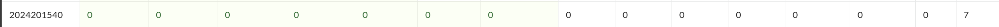

# bomblab 报告

姓名：张念昊

学号：2024201540

| 总分 | phase_1 | phase_2 | phase_3 | phase_4 | phase_5 | phase_6 | secret_phase |
| ---- | ------- | ------- | ------- | ------- | ------- | ------- | ------------ |
| 7    | 1       | 1       | 1       | 1       | 1       | 1       | 1            |

scoreboard 截图：



<!-- TODO: 用一个scoreboard的截图，本地图片，放到 imgs 文件夹下，不要用这个 github，pandoc 解析可能有问题 -->

## 解题报告

<!-- 对你拆掉的每个phase进行分析，并写出你得出答案的历程 -->

<!-- 如果能用伪代码还原题目源代码最佳（不属于先前提到的大段代码），语言描述自己的分析也可，每道题目的图片不建议超过两张 -->

### phase_1

```c
A fading Light awaits two in a closed world of forgotten Conflict.
```

输入一个字符串，程序会调用函数`string_length`统计输入串的长度与答案串的长度，若不一样就引爆炸弹。否则，再逐一比较输入串与答案串的每一个字符，如果都相等,拆弹成功。

观察`lea    0x1d40(%rip),%rsi`可知目标串在 0x1d40 处，使用 ida 可以很方便的得知目标串为"A fading Light awaits two in a closed world of forgotten Conflict."

### phase_2

```c
963893 1970810 744368 1172225
```

函数开头从读入的字符串中读入四个数，如果不足四个数则引爆炸弹。

接下来进入循环可以看到，内部基于 matA_3 和 matB_2 两个数组计算了四个数，这四个数的生成方式如下

```
c0 = a0 * b0 + a1 * b2 + a2 * b4
c1 = a0 * b1 + a1 * b3 + a2 * b5
c2 = a3 * b0 + a4 * b2 + a5 * b4
c3 = a3 * b1 + a4 * b3 + a5 * b5
```

然后将读入的四个数与计算得到的四个数进行比较，如果不相等则引爆炸弹。

使用 ida 可以容易的读取到 matA_3 和 matB_2 的值。其实该过程就是实现了一个矩阵乘法。

### phase_3

```c
4 18
```

读入两个数，如果第一个数不在 0 ~ 7 之间则爆炸，然后根据读入的第一个数进入 switch 语句的不同分支，每个 switch 语句都会创建一个变量并赋不同的初值，然后减去一个常量 delta_1，得到的值要保证是个非负数，读入的第二个数与该值相同即可拆除炸弹。

### phase_4

```c
31 AC
```

读入一个数和一个两字符的字符串， 该数字需要等于 func4_1(5) 返回的结果。func4_1() 伪代码见下：

```c
int func4_1(int n) {
    if (n <= 0) {
        return 0;
    }
    if (n == 1) {
        return 1;
    }
    return 2 * func4_1(n - 1) + 1;
}
```

对于读入的字符串需要满足 func4_2(n, m, L1, L2, L3) 的要求，模拟函数过程如下：

初始为 `func4_2(5, 1, A, B, C)`， `n = 5 != 1` 进入分支，调用 `func4_1(n - 1) >= m`，进入分支，递归调用 `func4_2(4, 1, A, C, B)`、`func4_2(3, 1, A, C, B)`、`func4_2(2, 1, A, C, B)`、`func4_2(1, 1, A, C, B)` 到达 `n == 1` 分支，`%dl、%cl` 寄存器中的值即为目标字符串的值，即 "AC"。

### phase_5

```c
346789
```

读取一个有六字符的字符串记为 s，程序内存有一个数组其内容如下

```
int array_0[16] = {
    2, 10, 6, 1,
    12, 16, 9, 3,
    4, 7, 14, 5,
    11, 8, 15, 13
};
```

程序要做的就是计算 array_0[s\[0\] & 0xf\] + array_0[s\[1\] & 0xf\] + ... + array_0[s\[5\] & 0xf\] 的和，如果和等于 0x24 则拆弹成功。

可以看到选取数组中 3，4，6，7，8，9 号元素的和为 36(0x24)，而一个数字的 ASCII 码最低 4 位正好是该数字本身，因此输入字符串为"346789"。

### phase_6

```c
1 6 4 2 3 5
```

输入六个数字，程序先检查输入的六个数字是否在 1 ~ 6 之间且不重复。然后根据输入的六个数字构造一个链表，链表节点定义如下：

```c
struct ListNode {
    int value;
    int index;
    struct ListNode *next;
};
```

每个链表节点中前 4 字节存储节点的值 value，接下来的 4 字节存储节点的索引 index，后 8 字节存储下一个节点的地址 next。

初始时链表节点按 index 从小到大依次连接，然后根据输入的数字找到下标对应的节点，存放在栈的 rsp+88h+var_68 到 rsp+88h+var_40 之间，然后通过 `mov     [rbx+8], rax` 语句将这些节点连接成一个新的链表。 最后检查新链表中的节点值是否按从大到小排列。

### secret_phase

```c
2626263315311
```

通过分析汇编可以得知，secret_phase 的入口在 phase_defused 函数中，当读入的字符串为 6 行时，即完成 pahse1~6 后，若满足

1. 最后一行输入的内容中含有 6 个空格
2. 第六个空格后的字符串为 binary

则会触发 secret_phase 函数，而 secret_phase 函数会读入一个字符串然后调用 func7(char \*s, size_t a, size_t b, size_t c) 函数，返回值不为零则拆弹成功。对 func7 的分析如下：

1. 进入 func7 函数首先判断是否满足条件 a==4 and b==7, 若满足则返回 1，程序调用结束
2. 然后判断 c 是否大于 19 （0x13），若大于则返回 0，程序调用结束；判断 s\[c] 是否为 0，若为 0 则返回 0，程序调用结束
3. 取 s\[c] & 7 的值（记为 index）作为下标从函数开始定义的一维数组中取出第 index index+8 index+16 index+24 四个值，分别加到 a,b 上，将他们记为 x1, y1, x2, y2 然后判断二维数组 rows\[a+x1][b+y1] 和 rows\[a+x2][b+y2] 的值，若为 1 则返回 0，程序调用结束。注：在原函数中 rows 是以链表的形式实现的，为表述方便这里将其还原为二维数组
4. 递归调用 func7(s, a+x1, b+y1, c+1)

由上可知，func7 函数实现了一个在二维数组中移动的过程，初始位置为 (0,0)，目标位置为 (4,7)，每次移动的步长由输入字符串 s 的每个字符决定，而每次移动后的位置必须满足二维数组对应位置的值为 0。

所以可以直接跑一个 DFS 来搜索可行解，运行可以发现 2626263315311 是一个可行解。

```cpp
int rsp[] = {
    // func7 函数开始定义的数组
};
int rows[7][8] = {
    // rows 中定义的内容
};
char cc[] = "01234567";
void func(char c, int a, int b, std::vector<char> list) {
    if (a == 4 && b == 7){
        // 找到解
    }
    if (list.size() >= 20){
        return;
    }
    list.push_back(c);
    int r10d = c;
    r10d &= 7;
    int rsi = r10d;
    int r8d = a;
    r8d += rsp[rsi]; // 取出相应index+x中的值
    int r11d = b;
    r11d += rsp[rsi + 8];
    int rax = a;
    int rdx = b;
    rax += rsp[r10d + 16];
    rdx += rsp[r10d + 24];
    //越界，合法性检查
    if (rows[rax][rdx] == 1) {
        return;
    }
    //...
    for (int i = 0; i < 8; i++)
    {
        func(cc[i], r8d, r11d, list);
    }
}
int main() {
    int a = 0, b = 0;
    std::vector<char> list;
    for (int i = 0; i < 8; i++) {
        func(cc[i], a, b, list);
    }
}
```

## 反馈/收获/感悟/总结

<!-- 这一节，你可以简单描述你在这个 lab 上花费的时间/你认为的难度/你认为不合理的地方/你认为有趣的地方 -->

<!-- 或者是收获/感悟/总结 -->

<!-- 200 字以内，可以不写 -->

花费时间：两个下午加一个晚上

难度适中，我使用了 IDA 的辅助，在跳转逻辑和静态变量分析上节省了不少时间

把汇编写成 c 代码比直接硬看汇编容易多了

## 参考的重要资料

<!-- 有哪些文章/论文/PPT/课本对你的实现有重要启发或者帮助，或者是你直接引用了某个方法 -->

<!-- 请附上文章标题和可访问的网页路径 -->
